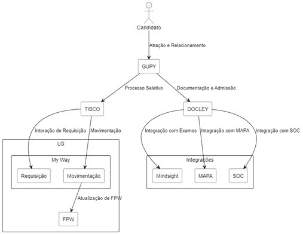
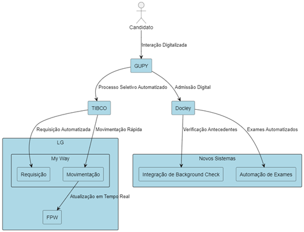
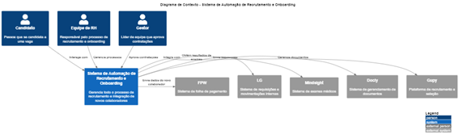
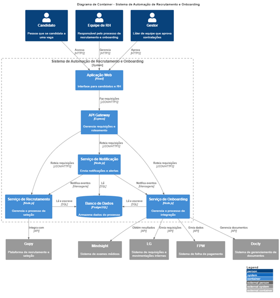
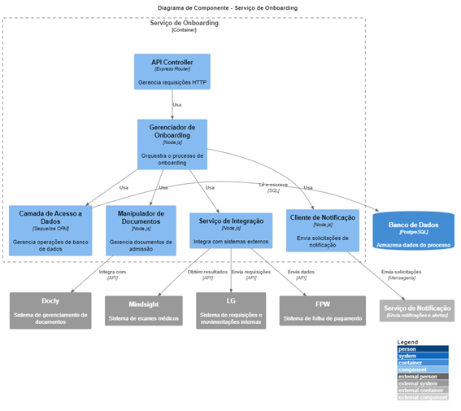

# 5ASOR FIAP MBA Arquitetura de Soluções

### Trabalho de Conclusão de Arquitetura da Escolha (UX, Design Thinking e Modern Web)
**Leonardo Carneiro Pinho**

EQUIPE
- Anderson Luís Lins Rocha
- Carlos Correa
- Fabio Ferreira da Silva
- Giliane Maciel do Vale
- Michael André Santos Brito
- Renato Hideyoshi Tamanaha

_Número dos RMs foram removidos por segurança_

**LINK PARA O VÍDEO NA PLATAFORMA FIAP**
**

### PROBLEMAS

A companhia enfrenta um processo de recrutamento e onboarding fortemente dependente de etapas manuais, desde a atração e seleção de candidatos até a integração final dos novos colaboradores. Na fase de Atração e Relacionamento, campanhas de recrutamento e contatos iniciais são gerenciados manualmente, criando ineficiências na comunicação e dificultando a centralização de dados. Durante o processo seletivo, candidaturas, testes, entrevistas e follow-ups são realizados em diversas plataformas desconectadas, o que gera duplicidade de tarefas e retrabalho para compilar informações. As “Devolutivas” aos candidatos, tanto negativas quanto positivas, são feitas manualmente, aumentando o tempo de resposta e impactando a experiência do candidato.

Quando o candidato é aprovado, o Onboarding é igualmente fragmentado. A entrega de documentos, exames médicos, abertura de conta bancária, assinatura de contrato e entrega de benefícios são realizados por diferentes atores, sem automação. Isso leva a falhas de comunicação, atrasos na entrada de novos colaboradores e, frequentemente, erros no manuseio de documentos.

Essa abordagem manual limita a capacidade do RH de lidar com um volume maior de contratações, exigindo mais recursos humanos à medida que as demandas aumentam. A falta de automação no processo não apenas atrasa a contratação e integração dos novos colaboradores, como também sobrecarrega a equipe de RH com tarefas administrativas repetitivas. Portanto, a automatização se torna crucial para escalabilidade e eficiência, permitindo que a equipe de RH se concentre em atividades mais estratégicas e menos operacionais.

### PREMISSAS

- Automatização como solução chave: Há uma forte ênfase na necessidade de automatizar processos manuais para aumentar a eficiência e reduzir erros. 
- Integração de sistemas existentes: A solução deve integrar-se com sistemas já em uso, como Gupy, Docly, Mindsight, LG e FPW, em vez de substituí-los completamente. 
- Melhoria da experiência do candidato: Uma das metas implícitas é melhorar a experiência do candidato durante o processo de recrutamento e onboarding. 
- Redução de carga de trabalho do RH: Assume-se que a automatização permitirá que a equipe de RH se concentre em tarefas mais estratégicas. 
- Escalabilidade: A solução deve ser capaz de lidar com um aumento no volume de contratações sem necessidade de aumentar proporcionalmente a equipe de RH. 
- Conformidade com regulamentações: Embora não explicitamente mencionado, é uma premissa comum que a solução deve estar em conformidade com regulamentações de proteção de dados (como a LGPD mencionada nos requisitos não funcionais). 
- Melhoria na comunicação: Presume-se que a solução deve melhorar a comunicação entre todas as partes envolvidas no processo (candidatos, RH, gestores, sistemas externos). 
- Centralização de dados: Infere-se a necessidade de centralizar as informações do processo de recrutamento e onboarding para facilitar o acesso e a gestão. 
- Flexibilidade e customização: Considerando a complexidade do processo, presume-se que a solução deve ser flexível e customizável para atender às necessidades específicas da empresa. 
- Redução de tempo do processo: Embora não explicitamente declarado, é uma premissa comum que a automatização e otimização do processo resultarão em uma redução significativa no tempo total do ciclo de recrutamento e onboarding.

### REQUISITOS FUNCIONAIS

- Integração Automática de Dados: O sistema deve permitir que os dados de recrutamento (Gupy) sejam automaticamente integrados com os processos internos (LG), sem intervenção manual.
- Assinatura Digital de Documentos: Implementar assinatura eletrônica para facilitar a assinatura de contratos e outros documentos de admissão, evitando processos em papel.
- Envio de Documentos Automatizado: O candidato deve poder enviar e gerenciar documentos pelo Docly, com notificações automáticas para o RH e líderes de equipe.
- Integração com Exames Médicos: O sistema deve garantir que os dados dos exames médicos (Mindsight) sejam conectados ao onboarding, automatizando o processo de aptidão.
- Controle de Propostas e Devolutivas: O sistema precisa gerenciar automaticamente a resposta a candidatos (devolutivas positivas e negativas) e emitir propostas para os aprovados.
- Notificações e Alertas: O sistema deve enviar notificações automáticas para o candidato e a equipe de RH em todas as etapas do processo.

### REQUISITOS NÃO FUNCIONAIS
- Segurança de Dados: Todos os dados pessoais e documentos devem ser tratados de acordo com as normas de proteção de dados (LGPD), com criptografia em repouso e em trânsito.
- Disponibilidade e Confiabilidade: O sistema deve ser altamente disponível (99,9% uptime) para garantir que os processos de recrutamento e onboarding não sejam interrompidos.
- Escalabilidade: O sistema deve ser capaz de lidar com um número crescente de candidatos e colaboradores sem perda de performance.
- Usabilidade: A interface deve ser amigável e intuitiva para candidatos e usuários internos (RH), com baixa curva de aprendizado.
- Tempo de Resposta: As ações críticas, como envio de documentos e integração de dados, devem ser processadas em no máximo 3 segundos para garantir eficiência.
- Compatibilidade Multiplataforma: O sistema deve funcionar em dispositivos móveis, desktops e ser compatível com diferentes navegadores para facilitar o acesso por parte dos candidatos e funcionários.

### 1. Montar um Story Telling sobre o problema que você resolve e definir o tema (Verificar nos slides da aula 1 sobre os temas sugeridos) 

Empresa de logística em rápido crescimento, é conhecida por sua inovação e qualidade de produtos. No entanto, um problema significativo tem limitado seu potencial de expansão: o processo de onboarding de novos funcionários. Atualmente, esse fluxo é repleto de etapas manuais que consomem tempo e recursos, tornando a integração lenta, sujeita a erros e difícil de escalar. Toda vez que um novo colaborador é contratado, inicia-se um verdadeiro "vaivém" de e-mails, documentos físicos e tarefas manuais entre diferentes departamentos. Isso não só retarda o processo, mas também exige a dedicação de muitos profissionais de RH para acompanhar cada detalhe. A demanda crescente por talentos significa que, para continuar expandindo sua força de trabalho, a empresa precisaria aumentar constantemente sua equipe de RH - um modelo insustentável a longo prazo."

### 2. O que esperamos aprender com esse projeto?

Esperamos aprender como otimizar o processo de onboarding e integração de novos funcionários, automatizando tarefas manuais e garantindo uma melhor experiência tanto para o candidato quanto para a empresa.

### 3. Que perguntas precisamos que sejam respondidas?

- Como podemos melhorar a eficiência do processo de recrutamento e onboarding?
- Quais integrações são necessárias para automatizar etapas críticas?
- Quais são os ganhos esperados em termos de tempo e qualidade da experiência do usuário?

### 4. Quais são os nossos principais riscos?

- Falha nas integrações entre os sistemas (TIBCO, GUPY, etc.).
- Resistência à mudança por parte dos funcionários que operam os processos atuais.
- Dificuldades na implementação técnica das novas soluções e automações.

### 5. Crie um plano para aprender o que precisamos para responder a perguntas específicas

- Realizar mapeamento de processos atuais com detalhes.
- Fazer testes piloto com as novas ferramentas de automação.
- Monitorar feedbacks dos stakeholders, especialmente dos usuários finais (RH e candidatos).

### 6. Crie um plano para reduzir riscos

- Desenvolver um plano de gestão de mudança focado na capacitação dos usuários.
- Implementar integração em fases, priorizando as partes mais críticas primeiro.
- Garantir ambientes de testes robustos antes de ir para produção.

### 7. Quem são as partes interessadas?

- Equipe de RH.
- Equipe de TI responsável pelas integrações.
- Equipe de Gestão.
- Novos contratados (candidatos).

### 8. O que eles esperam ganhar? Anderson

- Maior eficiência operacional.
- Redução de tempo no processo de onboarding.
- Melhor experiência para os novos contratados.
- Maior controle e automação dos processos de admissão e seleção.

### 9. Quem são os usuários? Anderson

- Equipe de RH.
- Candidatos.
- Equipe de TI.

### 10. O que eles estão tentando realizar?

- A equipe de RH busca otimizar o processo de recrutamento e onboarding, enquanto a equipe de TI busca garantir a integração e automação dos sistemas.
- Os candidatos buscam uma experiência de contratação rápida e eficiente.
  
### 11.	Qual o pior que pode acontecer?

- As automações podem falhar, resultando em atraso no processo de admissão, além de causar insatisfação tanto para os candidatos quanto para a equipe de RH.

### 12.	Desenhe uma arquitetura (Modelo Freeform - Versão inicial)

**AS IS**

**TO BE**

 
### 13. Faça uma descrição de cada um dos componentes que você desenhou

- LG: Sistema central que lida com requisições e movimentações internas de pessoal.
- My Way: Plataforma usada para solicitar e acompanhar movimentações de pessoal e aprovações.
- FPW: Sistema de folha que recebe os dados do novo candidato.
- TIBCO: Middleware que integra os diversos sistemas da empresa.
- GUPY: Plataforma de recrutamento e seleção.
- Docly: Sistema usado para o gerenciamento da documentação de admissão.
- Integrações (Mindsight, MAPA, SOC): Sistemas de terceiros que suportam atividades como exames médicos e validação de informações.

### 14. Descreva requisitos que você (s) considera importante e por quê? (Mínimo 5)

- Automação de Exames: Para acelerar o processo de admissão.
- Integração com TIBCO: Para garantir a comunicação entre os diferentes sistemas.
- Segurança de Dados: Importante para garantir a confidencialidade dos dados dos candidatos.
- Experiência do Candidato: Um fluxo amigável para evitar a perda de talentos.
- Controle e Relatórios: Para que o RH acompanhe cada etapa do processo com visibilidade total.

## 15. Sobre o que o diagrama ajuda você a raciocinar/pensar?

O diagrama nos ajuda a entender como os sistemas e processos de recrutamento, seleção e onboarding estão integrados. Ele destaca os pontos onde há automações, as comunicações entre diferentes plataformas e identifica possíveis gargalos ou áreas de melhoria.

## 16. Quais são os padrões essenciais no diagrama?

- Integração via TIBCO: O middleware centraliza as comunicações entre os sistemas principais.
- Divisão por Fases: Separação clara entre recrutamento, admissão e onboarding.
- Sistemas especializados: Cada sistema é responsável por uma parte específica do processo (ex.: Gupy para recrutamento, Docly para documentação).

### 17. Existem padrões ocultos?

Sim, o padrão oculto de dependência excessiva do TIBCO para integração pode ser identificado, o que pode se tornar um ponto único de falha.

### 18.	Qual é o Metamodelo?

O metamodelo envolve um conjunto de componentes tecnológicos (plataformas como Gupy, Docly, TIBCO) e processos de negócio (recrutamento, seleção, onboarding), conectados por fluxos de dados que automatizam o processo de admissão.

### 19.	Pode ser discernido no diagrama único? Renato

Sim, o metamodelo pode ser visualizado no diagrama, pois cada componente se conecta a um processo ou sistema específico, e suas interações estão descritas nas setas de integração.

### 20.	O diagrama está completo? Renato

O diagrama AS-IS está quase completo, mas a adição de outros fluxos manuais ou partes detalhadas do processo de aprovação interna poderiam torná-lo ainda mais claro.

### 21.	Poderia ser simplificado e ainda assim ser eficaz? Renato
Sim, focar apenas nas integrações críticas e eliminar detalhes mais técnicos poderia torná-lo mais fácil de compreender para pessoas não técnicas.

### 22.	Houve alguma discussão importante que vocês tiveram como equipe? Renato

Um ponto importante discutido foi a necessidade de uma interface única para o usuário final (RH), em vez de múltiplas interfaces com diferentes sistemas, para simplificar o trabalho diário.

### 23.	Que decisões sua equipe teve dificuldade para tomar? Renato

Decidir entre manter os sistemas separados ou buscar uma solução integrada completa que centralizasse todas as funcionalidades.

### 24.	Que decisões foram tomadas sob incerteza? Renato

A escolha de TIBCO como middleware, pois há a incerteza de como o sistema lidará com o aumento de volume e complexidade à medida que a automação for expandida.

### 25.	Houve algum ponto de decisão sem retorno que o forçou a desistir de uma determinada escolha? Renato

A decisão de manter o Gupy como plataforma de recrutamento limitou a flexibilidade em algumas partes do processo de integração, pois mudanças mais profundas exigiriam um esforço muito grande de customização.

### 26.	Desenhe 3 Arquiteturas com o projeto que você desenvolveu na aula em cada uma das camadas do C4; (Subir somente a Imagem jpg/jpeg)

Nota: Os 3 diagramas das arquiteturas foram carregados no gitHUB NESTE repositório público.

### 27.	Nível Contexto

**C4 CONTEXTO**

### 28.	Nível Container

**C4 CONTAINER**

 
### 29.	Nível Componente

**C4 COMPONENTE**

### 30.	Code (Opcional)

Item Opcional, não foi abordado pelo time.

### 31.	Validar no checklist (opcional) - https://c4model.com/review/

Validado
